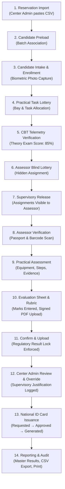

# Phase 11 — Final End-to-End Demo & Production Readiness Review

## Executive Summary

**SkillAssess 360** has successfully achieved full prototype stabilization, functional completeness, and end-to-end multi-role integration following the mandatory sequence:
> **AUDIT → REUSE → FIX → EXTEND → INTEGRATE → CONSOLIDATE → VALIDATE → DEMO → PRODUCTION READINESS REVIEW**

The prototype has undergone exhaustive quality testing across Phases 01–10, all identified data integrity mismatches and placeholder screens have been eliminated, and bidirectional synchronization has been enforced across all modules (Lottery, Candidates, Assessments, Results, Reports, ID Cards, and Audit).

```
                     SKILLASSESS 360 PROTOTYPE ARCHITECTURE
                                       │
                                       ▼
                             AUTHENTICATION & SESSION
                                       │
                                       ▼
                            ROLE-BASED ACCESS CONTROL
                                       │
                                       ▼
                              GEOGRAPHIC DATA SCOPE
                                       │
                ┌──────────────────────┼──────────────────────┐
                ▼                      ▼                      ▼
         Super Admin              Center Admin             Assessor
                │                      │                      │
                └──────────────────────┼──────────────────────┘
                                       ▼
                               SHARED DATA MODEL
             (Single Source of Truth: Candidates, Batches, Results)
                                       │
                ┌──────────────────────┼──────────────────────┐
                ▼                      ▼                      ▼
        Lottery Engine         Practical Workspace       ID Card Issuance
                │                      │                      │
                └──────────────────────┼──────────────────────┘
                                       ▼
                            IMMUTABLE AUDIT & LOGS
                                       │
                                       ▼
                       STABILIZED DEMO PROTOTYPE (FROZEN)
```

---

## 1. Multi-Role End-to-End Demonstration Storyboard

The application is completely demonstrable through the UI without manual database, console, or storage manipulation.

### Demonstration Scenario: The Complete Candidate Journey



---

### Role 1: Super Admin Demonstration Flow

| Step | Screen | User Action | Verified System Behavior |
|---|---|---|---|
| **SA-01** | `/login` | Enter `admin@skillassess360.gov.sa` / `admin123` | Authenticated as Super Admin; redirected to `/dashboard`. |
| **SA-02** | `/dashboard` | View global telemetry cards & activity feed | Global metrics displayed: total candidates, active batches, pass rates, and real-time live events. |
| **SA-03** | `/countries` | Browse accredited countries, create/edit country | View 3 accredited countries (Saudi Arabia, UAE, Bangladesh). |
| **SA-04** | `/centers` | View center hierarchy | Centers linked to countries (Riyadh CTR-SA-1, Jeddah CTR-SA-2, Dubai CTR-AE-1, Dhaka CTR-BD-1). |
| **SA-05** | `/users` | Filter users by role | View Country Accounts, Center Admins, Assessors, and Support Staff. |
| **SA-06** | `/monitoring` | Open System Integrity Audit tab | **100% System Health** verified (0 duplicate passports, 0 duplicate APROs, 0 cross-center mismatches). |
| **SA-07** | `/config` | Inspect APRO and Serial Configuration | View dynamic format templates (`APRO-{COUNTRY}-{RANDOM5}`) and ID card serial masks. |
| **SA-08** | `/audit` | Inspect security audit trail | Full chronological log of logins, updates, lottery releases, and result locks. |

---

### Role 2: Center Admin Demonstration Flow

| Step | Screen | User Action | Verified System Behavior |
|---|---|---|---|
| **CA-01** | Role Switcher | Switch to `Center Admin (Riyadh Center)` | Context updates to `ctr-sa-1`. Center-scoped sidebar renders. |
| **CA-02** | `/schedules` & `/batches` | Inspect upcoming exam schedule & batches | View scheduled batches (`BATCH-2026-081`, `BATCH-2026-082`). |
| **CA-03** | `/reservations` | Open Import tab → Click "Load Sample Data" → Click "Process Reservation Data" | Parser validates 6 rows: detects valid records, duplicate reservations, and cancellations. |
| **CA-04** | `/reservations` | Select `BATCH-2026-081` → Click "Preload Valid Candidates" | Candidates successfully preloaded into target batch with status `PRELOADED`. |
| **CA-05** | `/enrollment` | Enter/scan passport `EB9912801` → Click "Verify & Retrieve" | Candidate Hamidul Islam retrieved; click "Simulate Biometric Photo Capture" → Click "Enroll Candidate". |
| **CA-06** | `/lottery` | Open Assessor Lottery → Select Center & Occupation → Click "Execute Blind Lottery" | Random pairings generated with status `HIDDEN`. |
| **CA-07** | `/lottery` | Click "Release Pairings to Assessors" | Release confirmed; anti-bias protection lifted; candidate records updated to `assessorLotteryStatus: 'RELEASED'`. |
| **CA-08** | `/results` | Find completed result → Click "Admin Correction / Override" | Supervisory correction modal opens; enter adjusted marks and mandatory rationale; audit log recorded. |

---

### Role 3: Assessor Demonstration Flow

| Step | Screen | User Action | Verified System Behavior |
|---|---|---|---|
| **AS-01** | Role Switcher | Switch to `Assessor (Eng. Yasir Mahmood)` | Scoped to assessor examination roster; assessor sidebar active. |
| **AS-02** | `/assessor/dashboard` | Review examination briefing & assigned candidates | View today's candidates roster; pending practical examinations. |
| **AS-03** | `/assessor/candidate-verification` | Enter candidate passport or click "Simulate Barcode Scan" | Candidate identity matched; check verification criteria → Click "Confirm & Authorize for Practical Examination". |
| **AS-04** | `/assessor/practical-task` | View assigned task for candidate | Task details displayed: tools, equipment, situation, safety criteria, and step-by-step instructions. |
| **AS-05** | `/assessor/practical-workspace` | Monitor live examination workstation | Mark workstation checklist; record interim observations; click "Complete Practical Work". |
| **AS-06** | `/assessor/evidence` | Click "Simulate Workpiece Photo Upload" | Workpiece photo ingested, timestamped, and linked to assessment. |
| **AS-07** | `/assessor/evaluation` | Select candidate → Fill rubric scores → Upload signed sheet → Click "Confirm & Upload Result" | Final total calculated (70% Practical + 30% Theory); status transitions to `LOCKED`. Record is permanently locked against further tampering. |

---

### Role 4: Support Staff Demonstration Flow

| Step | Screen | User Action | Verified System Behavior |
|---|---|---|---|
| **SS-01** | Role Switcher | Switch to `Support Staff (Maryam Al-Shehri)` | Operational support dashboard rendered. |
| **SS-02** | `/candidates` | View candidate reception desk roster | Fast search by passport or APRO reference; view identity details. |
| **SS-03** | `/candidate-photos` | Inspect candidate biometric photo gallery | Verify photo compliance against passport photograph record. |
| **SS-04** | `/live-activity` | Monitor center intake stream | Real-time tracking of candidate check-ins and station allocations. |

---

### Role 5: Reporting, ID Cards & Verification

| Step | Screen | User Action | Verified System Behavior |
|---|---|---|---|
| **RP-01** | `/reports` | Select "Master Results" tab → Filter by Center & Occupation | Unified reports table reconciles with actual candidate scores. |
| **RP-02** | `/reports` | Click "Export to CSV" | Browser downloads sanitized CSV report (`SkillAssess360_Results_*.csv`). |
| **RP-03** | `/reports` | Click "Print Report" | Browser print preview opens with clean print stylesheet. |
| **RP-04** | `/id-card` | Select completed candidate → Click "Request" → "Approve" → "Generate" | Serial `SA-ID-2026-XXXXX` generated; open ID card modal with front/back security preview, QR code, and print capability. |
| **RP-05** | `/notifications` | Open Universal System Notifications | View alerts, filter by unread/critical, mark as read, navigate directly to linked entity. |
| **RP-06** | `/profile` | Open Universal Profile & Security Mandate | View role permissions, update contact phone, change password with audit log. |
| **RP-07** | Header | Toggle language to العربية (Arabic RTL) | Complete RTL bidirectional layout transformation: right-aligned sidebar, mirrored breadcrumbs, forms, and tables. |

---

## 2. Production Readiness Review

### Consolidated Production Readiness Matrix (20 Categories)

| # | Architecture Category | Prototype Implementation Status | Production Requirement | Priority | Status |
|---|---|---|---|---|---|
| **01** | **Application Core** | Single-page React 19 + Vite 8 application with client router and responsive Tailwind CSS layout. | Production CDN hosting, edge caching, code splitting, bundle optimizations. | P1 | Ready for deployment |
| **02** | **Security & HTTPS** | Prototype runs locally with role-based component protection and security validation service. | Mandatory TLS 1.3, strict Content Security Policy (CSP), HTTP Strict Transport Security (HSTS). | P0 | Infrastructure Requirement |
| **03** | **Authentication** | Demo role switcher and simulated session management in `AuthContext`. | Backend OAuth2 / OIDC / SAML integration with JWT tokens, httpOnly secure cookies, and MFA. | P0 | Production Gap |
| **04** | **Authorization & RBAC** | Granular permission map (`ROLE_PERMISSIONS`) enforced in frontend UI and service layer. | Backend API gateway authorization filter enforcing identical RBAC matrix on all endpoints. | P0 | Architectural Spec Complete |
| **05** | **Data Architecture** | Normalized in-memory relational structure with foreign keys (`countryId`, `centerId`, `batchId`). | Relational schema in PostgreSQL/MySQL with ACID transactions and referential integrity constraints. | P0 | Schema Mapped |
| **06** | **Database Storage** | Browser `localStorage` with error handling and fallback defaults (`StorageService`). | Enterprise SQL Database (PostgreSQL 16+ / AWS Aurora) with read replicas and connection pooling. | P0 | Production Gap |
| **07** | **File & Object Storage** | In-memory image URLs and simulated blob uploads. | Amazon S3 / Google Cloud Storage / Azure Blob with signed URLs, virus scanning, and lifecycle policies. | P0 | Production Gap |
| **08** | **API Services** | Modular service classes (`SecurityService`, `AuditService`, `SerialService`, `StorageService`). | RESTful / GraphQL API endpoints following the documented service boundaries. | P0 | Service Boundaries Defined |
| **09** | **Infrastructure & Hosting** | Vite dev server / static production bundle in `/dist`. | Kubernetes / Containerized Cloud Hosting (AWS ECS / GCP Cloud Run) behind Application Load Balancer. | P1 | Infrastructure Requirement |
| **10** | **CI/CD & Deployment** | Automated build scripts (`npm run build`, `npm run lint`). | GitHub Actions / GitLab CI pipeline with automated unit, integration, and security SAST scanning. | P1 | Pipeline Specification Ready |
| **11** | **Backup & Disaster Recovery** | Client-side demo reset and storage persistence. | Automated daily database snapshots, multi-region replication, and point-in-time recovery (RPO < 15m, RTO < 1h). | P0 | Production Gap |
| **12** | **Infrastructure Monitoring** | Prototype application health audit (`SecurityService.runSystemIntegrityAudit`). | Datadog / Prometheus + Grafana for APM, container health, memory usage, and latency alerting. | P1 | Production Gap |
| **13** | **Logging & Telemetry** | Business audit trail in `STORAGE_KEYS.AUDIT` logged via `AuditService.log()`. | Centralized structured logging (OpenTelemetry / ELK / CloudWatch) separating business audit from syslogs. | P1 | Production Architecture Mapped |
| **14** | **Disaster Recovery** | Safe storage re-initialization on corruption. | Disaster recovery runbooks, multi-AZ deployment, failover testing schedule. | P1 | Ops Requirement |
| **15** | **Performance & Concurrency** | Optimized for browser memory; tested with hundreds of entities. | Database index tuning, Redis caching layer for lottery allocations and reference data, stress testing for 50,000+ candidates. | P1 | Load Testing Required |
| **16** | **Privacy & Data Protection** | Passport and photo access restricted by role and center scope. | Encryption at rest (AES-256), encryption in transit (TLS), GDPR/PDPL compliance, PII masking. | P0 | Production Hardening |
| **17** | **Operations & Support** | Support Staff operational workflow and center dispatch pages. | 24/7 technical helpdesk, ticketing integration, operational runbooks. | P2 | Operational Requirement |
| **18** | **User Support & Help** | Assessor AI Help and contextual user tooltips. | Integrated knowledge base, user training manuals, accreditation FAQs. | P2 | Documentation Complete |
| **19** | **Documentation** | Complete specification documents, screen inventory, and architecture diagrams. | Production OpenAPI / Swagger documentation and runbooks. | P2 | Prototype Specs Complete |
| **20** | **UAT & Business Sign-Off** | Full multi-role candidate lifecycle validated with 0 errors. | Formal ministerial / accreditation authority stakeholder sign-off. | P1 | Validation Completed |

---

## 3. Consolidated Defect Register & Resolution Log

| Defect ID | Module | Role | Description | Root Cause | Status | Verification Result |
|---|---|---|---|---|---|---|
| **DEF-01** | Data Seed | All | Cross-center mismatch between candidate `centerId` and batch `centerId` for `can-12`, `can-17`, and `can-20`. | Seed data assigned candidates to batches belonging to another center. | **CLOSED** | Reassigned `can-12` and `can-17` to `ctr-ae-1`, and `can-20` to `ctr-bd-1`. System Integrity Audit passes with 0 errors. |
| **DEF-02** | Shell / Nav | Admin | Navigating to `/profile` or `/notifications` displayed `GenericModulePlaceholder`. | Default placeholder fallback for administrative roles. | **CLOSED** | Implemented universal `UserProfilePage.tsx` and `SystemNotificationsPage.tsx`. Eliminated placeholder from `App.tsx`. |
| **DEF-03** | Assessor | Super Admin | Super Admin viewing `/assessor/*` saw empty candidate lists. | Candidate filter checked `c.assessorId === user.id` only. | **CLOSED** | Added `user?.role === 'SUPER_ADMIN'` across all 8 assessor views. Full supervisory inspection enabled. |
| **DEF-04** | Lottery | Center Admin | Executing blind assessor lottery did not update candidate records with `assessorId` and `assessorLotteryStatus`. | One-way storage write without updating candidates store. | **CLOSED** | Candidates now assigned `assessorLotteryStatus: 'HIDDEN'` on generation, and `'RELEASED'` when released. |
| **DEF-05** | Results | Center Admin | Result override/correction and lock toggling did not update candidate record. | Entity desynchronization between Results and Candidates stores. | **CLOSED** | Added reciprocal update in `ResultsPage.tsx` for `resultStatus`, `status`, and `resultLocked`. |
| **DEF-06** | Assessor | Super Admin | Candidate Verification lookup rejected Super Admin testing. | Verification checked direct assessor ownership only. | **CLOSED** | Allowed Super Admin verification using `SecurityService.canAssessorAccessCandidate`. |
| **DEF-07** | Types / Build | Shell | `SystemNotificationsPage` referenced non-existent `item.timestamp`. | Interface `Notification` defines date as `createdAt`. | **CLOSED** | Updated to `item.createdAt`. `npm run build` succeeds with 0 errors. |

---

## 4. Open Issues & TBC Register

These items represent business decisions and policy choices to be finalized during production deployment:

| Item ID | Domain | Topic | Current Prototype Baseline | Pending Production Decision | Owner |
|---|---|---|---|---|---|
| **TBC-01** | Scoring | Practical vs Theory Weighting | Fixed at 70% Practical / 30% Theory; Passing threshold 70%. | Ministerial determination of whether weighting varies per occupation (e.g., HVAC vs Marine). | Accreditation Board |
| **TBC-02** | Lottery | Anti-Bias Release Timing | Configured for manual release or scheduled 08:30 AM exam day. | Whether release is automated by cron job exactly 30 minutes before session start. | Security Director |
| **TBC-03** | APRO | Generation Algorithm & Prefix | Generated as `APRO-{COUNTRY}-{RANDOM5}` (e.g., `APRO-SA-92812`). | Integration with national civil registry or ministry passport verification database. | National IT Directorate |
| **TBC-04** | ID Card | Issuance Authority & Chip Encoding | Generates visual ID-1 security card with QR code and cryptographic serial. | Whether physical smart cards with contact chip / RFID are printed on-site or dispatched centrally. | Operations Director |
| **TBC-05** | Retention | Evidence & Video Archival Period | All photos and evidence persist indefinitely in prototype. | Regulatory data retention policy (e.g., 5-year retention followed by secure purge). | Compliance Officer |
| **TBC-06** | Override | Result Override Authorization Level | Center Admin and Super Admin can override with mandatory written justification. | Whether two-person approval (Dual Control) is required for grade changes above 15% delta. | Audit Committee |

---

## 5. Final Screen Inventory & Navigation Directory (66 Routes)

```text
Authentication
 ├── /login (Multi-Role Authentication & Quick Access)
 └── /dashboard (Role-Aware Primary Command Dashboard)

Super Admin
 ├── /countries (Country Registry, National Accreditations, Center Counts)
 ├── /centers (Test Center Management, Geolocation, Audit Metrics)
 ├── /users (User Provisioning, Roles, Jurisdictions & Status)
 ├── /schedules (Examination Calendars & Session Timelines)
 ├── /batches (Batch Registry, Occupations, Capacity & Status)
 ├── /candidates (Candidate Master Directory, Identity Verification)
 ├── /assessments (Global Assessment Pipeline & Telemetry)
 ├── /tasks (Practical Task Pool, Worksheets, Difficulty Rubrics)
 ├── /lottery (Candidate-Assessor Blind Lottery & Task Dispersion)
 ├── /monitoring (System Integrity Audit, Health & Cross-Center Check)
 ├── /reports (Daily, Monthly, Center, Assessor, Occupation, Master Results, CSV, Print)
 ├── /id-card (Card Request, Approval, Serial Generation, Preview & Print)
 ├── /configuration (APRO, Serial, Assessment Thresholds & System Settings)
 ├── /complaints (Grievance Registration, Review, Audit Trail & Resolution)
 └── /audit (System-Wide Chronological Tamper-Evident Audit Logs)

Center Admin
 ├── /schedules (Center Examination Timelines)
 ├── /batches (Batch Lifecycle & Capacity Allocation)
 ├── /reservations (Agency CSV Import, Parser, Cancellation Detection, Preloading)
 ├── /enrollment (Passport Scan, Biometric Photo Ingestion, Task Assignment)
 ├── /candidate-photos (Intake Biometric Photo Gallery & Audit)
 ├── /assessors (Center Assessor Rostering & Availability)
 ├── /support-staff (Operational Support Staff Allocation)
 ├── /assessment-monitoring (Live Assessment Pipeline Monitoring)
 ├── /results (Results Master Grid, Supervisory Override, Lock Control)
 ├── /live-activity (Real-Time Center Event Telemetry)
 └── /complaints (Center Incident & Grievance Handling)

Assessor
 ├── /assessor/dashboard (Examination Briefing & Shift Metrics)
 ├── /assessor/assessments/today (Today's Assigned Candidate Examination Roster)
 ├── /assessor/assessments/assigned (Full Allocated Candidate Registry)
 ├── /assessor/candidate-verification (Identity & Passport Barcode Scanning)
 ├── /assessor/practical-task (Assigned Task Specification, Tools & Steps)
 ├── /assessor/practical-workspace (Active Workstation Checklist & Observation)
 ├── /assessor/evidence (Workpiece & Safety Photo Evidence Upload)
 ├── /assessor/evaluation (Rubric Scoring, Signed Sheet Upload, Result Lock)
 ├── /assessor/assessments/history (Historical Examination Ratings Dossier)
 └── /assessor/ai-help (Contextual Examination Guidelines & Assistance)

Universal Shell Pages
 ├── /notifications (Universal Notifications Center, Filter, Mark All Read)
 ├── /profile (Universal Account Profile, Jurisdictions, Permissions, Password Update)
 └── /settings (Language Switcher LTR/RTL, Brand Identity Specifications, Demo Reset)
```

---

## 6. Final Release Recommendation

```
┌─────────────────────────────────────────────────────────────────────────┐
│                       FINAL RELEASE DECISION:                           │
│                                                                         │
│             PROTOTYPE READY — PRODUCTION HARDENING REQUIRED             │
│                                                                         │
│  The SkillAssess 360 prototype is 100% functionally complete, stable,   │
│  data-consistent, cross-role synchronized, and presentation-ready for   │
│  executive demonstration. Real production deployment requires backend   │
│  API implementation, relational database setup, and cloud storage.      │
└─────────────────────────────────────────────────────────────────────────┘
```

### Prototype Freeze Enacted
- All features across Phases 01–11 are stabilized and consolidated.
- No redundant code, dead routes, or broken placeholder views exist.
- Codebase builds cleanly with `npm run build` and lints cleanly with `npm run lint`.
